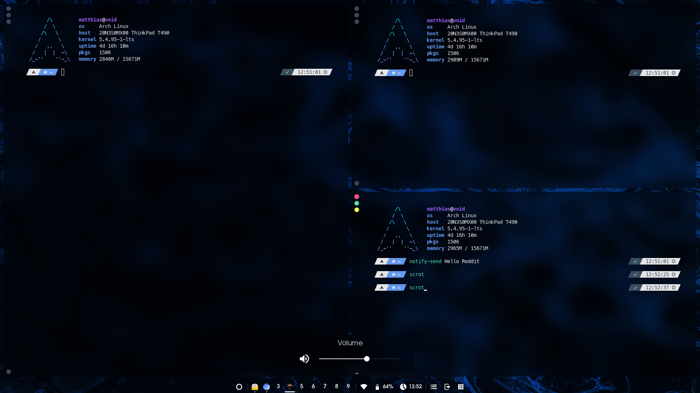
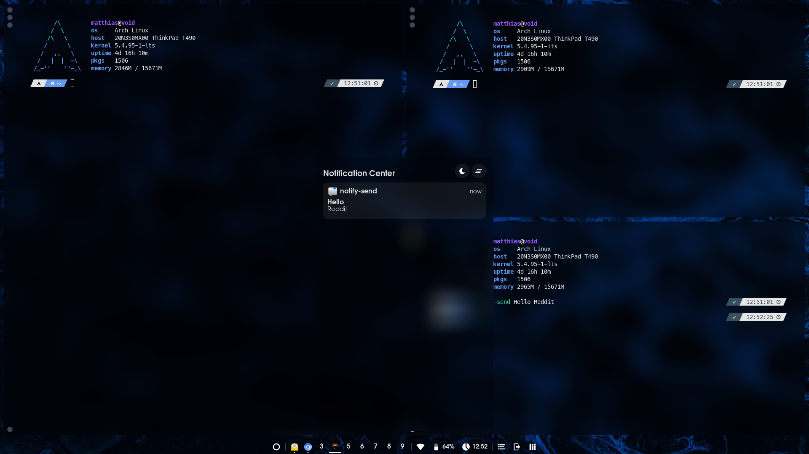
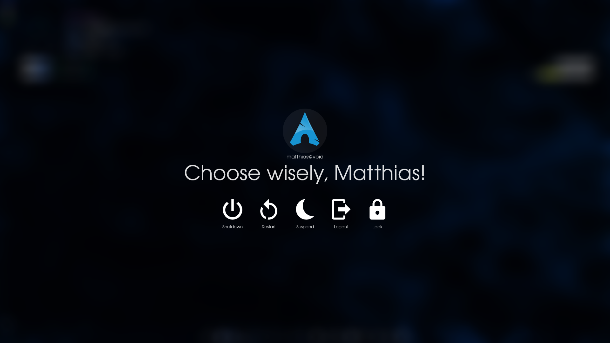
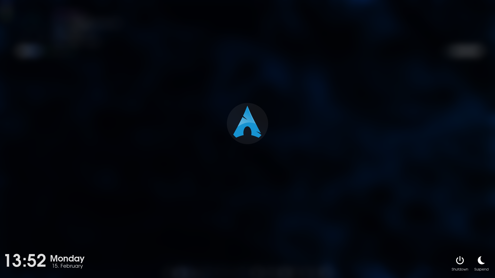

# Images
<!-- 

 -->
<table border="0">
 <tr>
    <td>
    
    
    </td>
    <td>
    
    
    </td>
 </tr>
</table>

# Description

A pretty, blurry and efficient Awesome WM configuration.
With only about 1% of CPU usage (Intel i5 7th gen) but still a pretty shiny window manager with some widgets and popups.
I tried to integrate everything in Awesome and have as few dependencies as possible.
lock-screen, notification center, volume- and brightness-popup and calender widget as well as battery and network widgets are already part of this config.

The panel can be configured with a very simple syntax.
Tag list shows the currently focused task on each tag.
Images zoom when hovering.

# Set it up

## Dependencies:
* `awesome-git` version with `lua 5.3` (not luajit!)
* `picom` fork for compositor: `tryone`, `jonaburg` or `ibhagwan` to get the blur
* `Networkmanager` for network widget
* `pactl` and `amixer` for audio
* `upower` for battery widget
* `xbacklight` for brightness
* `rofi-git`

## Installation:

1. Clone this git repo at some directory you desire (I clone it into `~/Git/awesome-wm-git`)
2. Put at least `rc.lua` and `configuration/picom.conf`, `liblua_pam.so` and `autostart.sh` into `~/.config/awesome/` .
 Awesome will first search in `~/.config/awesome` for all the files. If it does not find it there it will search in other directorys specified in line 1 of `rc.lua`.
 If you like to change keybindings, theme, widgets or anything else, copy the file also in `~/.config/awesome/` so it will be loaded instead of the default config.
3. Reload Awesome and press `Mod + Ctrl + a` to read through the keybindings. Modify and adjust to your liking.
4. Enjoy!

# Dotfiles

Please find my dotfiles in this [repo](https://github.com/archias-lnx/dots-of-the-dots).

# Contributing

Feel free to write your own widgets.
Templates for dashboard widget and popup are already present.

TODOs:
* Lockscreen catches events of mouse and keyboard to restart the timer for switching of the screen
* Launch or Switch for Clients such as Firefox
* Scratchpad stays scratchpad after reload